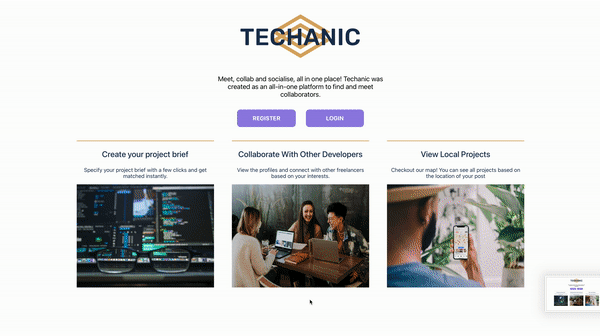
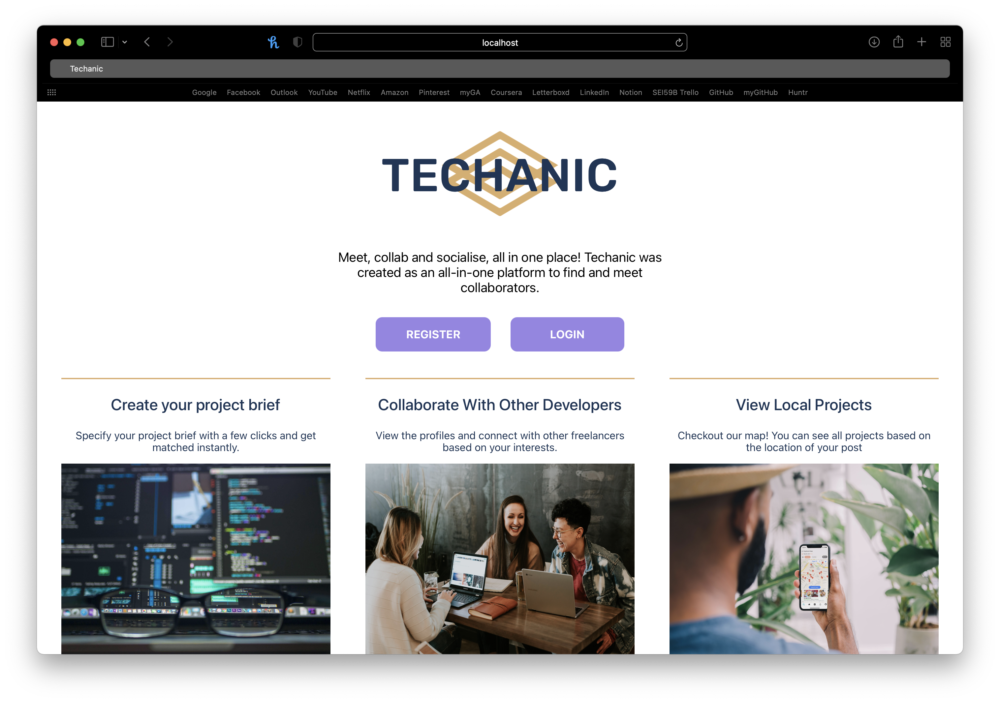
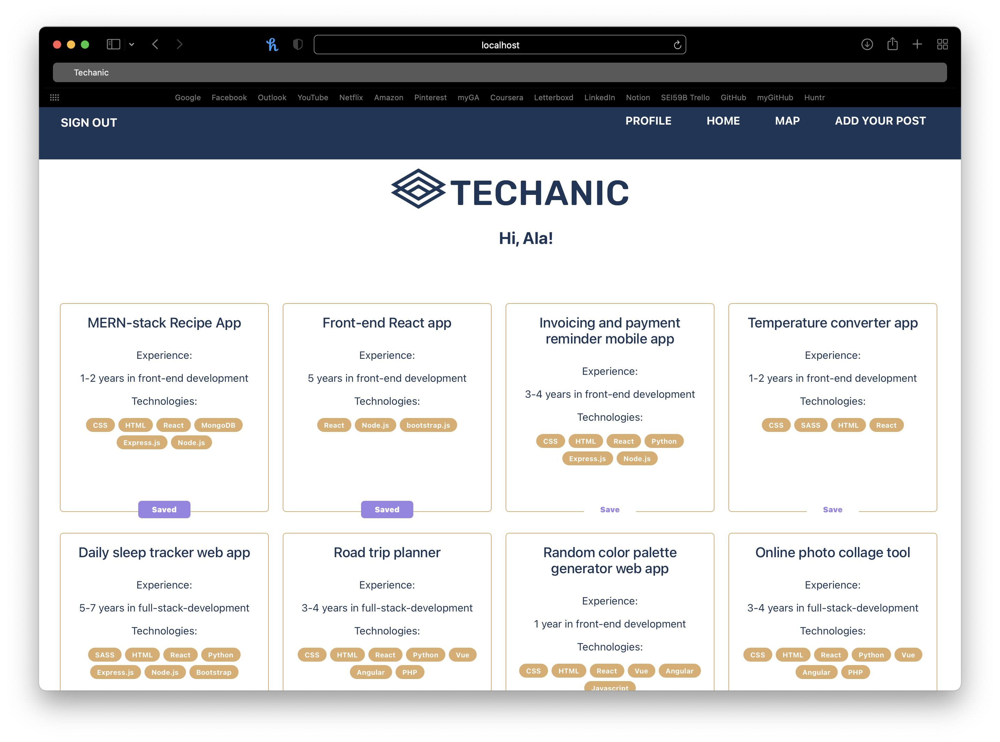
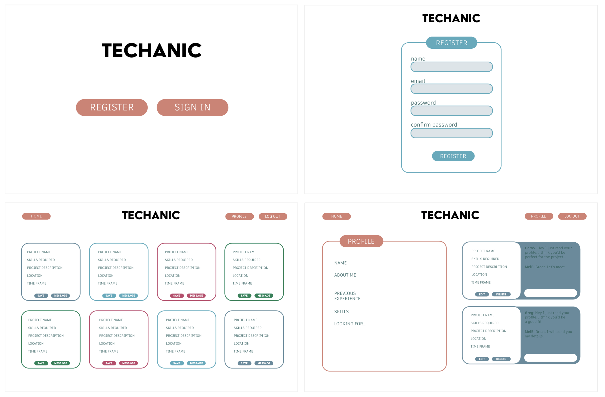
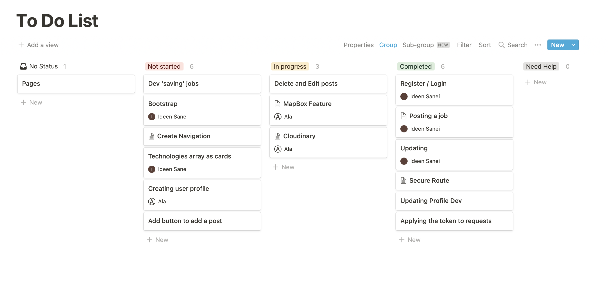
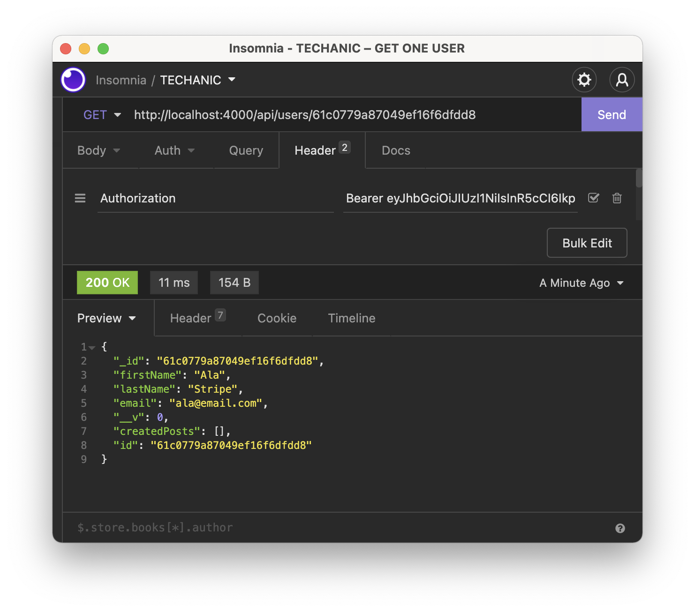
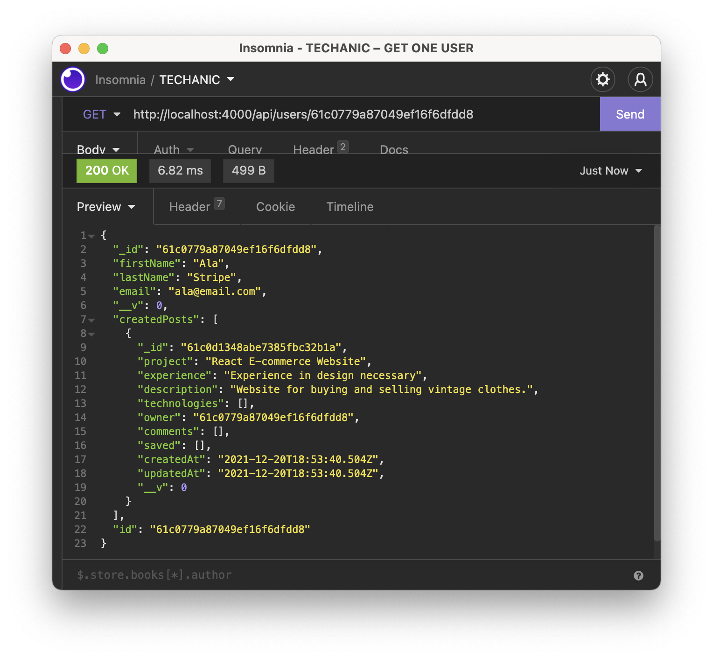
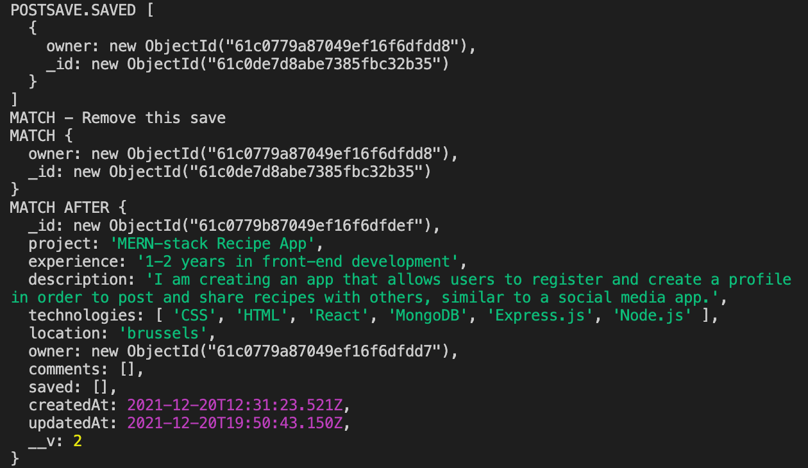
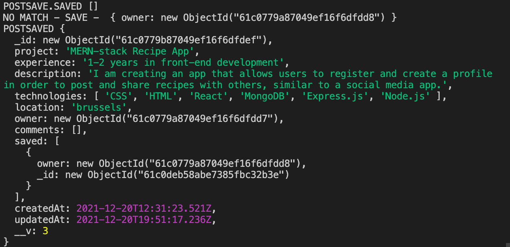

# Project 3: TECHANIC

## Overview
This was the third project on the General Assembly course and the first group project. The aim of the application is to create a platform where new developers can meet up and collaborate with each other on personal projects that they have posted on the site. The user can create a post and add details of the project, such as the skills and languages required, as well as viewing other users’ posts.

Teammates: Ala Abdelrahman, Octavie Ploye

Timeframe: 1 week





## Brief

Build a MERN-stack application by creating your own backend and your own frontend.
Use an Express API to serve your data from a Mongo database.
Consume the API with a separate frontend.
Include multiple relationships and CRUD functionality.

## Deployment

Please click [here](https://techanic.herokuapp.com/) to view the deployed project.
The application is deployed on Heroku so please give the server a few moments to warm up!

## Technologies

- JavaScript
- HTML5
- CSS3
- SASS
- React.js
- Mongoose
- MongoDB
- Express
- Axios
- Git
- GitHub
- Insomnia
- Cloudinary
- Mapbox
- Heroku

## Getting Started

- Clone or download the project repo
- Install project dependencies with `yarn`
- In the project root run `yarn serve`
- In the frontend run `yarn start`
- Find the project at `http://localhost:4000` in your browser

## Approach

The project began by mapping out potential endpoints as well as creating a wireframe of the frontend of the application. From here, we also discussed our aims for the MVP, as well as additional features we would like to add if time permitted.

### Wireframe


### Endpoints
| Endpoint      | Method |
| ----------- | ----------- |
| /users      | GET       |
| /users/:id   | GET        |
| /profile      | GET, POST      |
| /profile:id      | PUT, DELETE       |
| /posts      | GET, POST       |
| /posts/:id      | GET, PUT DELETE     |
| /register      | POST       |
| /login      | POST       |

### MVP
Authentication and authorisation:
- Register and login successfully.
- Only update and delete a post that the user has created.

Home page:
- View all posts seeded from the database.
- Add a post, as well as update and delete their own post.

Profile:
- Create a profile and update the profile.

Additional features:
- View all posts on a map using Mapbox
- Upload profile pictures using Cloudinary
- Add ‘save’ post functionality

### Work Split
For the first few days of the project, we worked on the backend of the application together, with me taking the lead and the team supporting. We then split up the work so that Ala would integrate Mapbox into the application while I worked on the structure of the frontend with React. In the last few days of the project, Ala took the lead in styling the site with CSS.

For project management, I used Notion to display tasks, notes, and resources in a shared environment with the team. Here is a snapshot of how we used Notion to manage our tasks:



### Backend
From here, the first step was to create a robust backend with the appropriate schema and endpoints. 

#### Models
The user model was particularly interesting as it needed to have several reverse relationships in order to populate the appropriate user information in the API response.

```
const userSchema = new mongoose.Schema({
 firstName: { type: String, required: true },
 lastName: { type: String, required: true },
 email: { type: String, required: true, unique: true },
 password: { type: String, required: true },
})
```

An example of this is being able to populate the user data with the posts that the user has created. 

Here is the reverse relationship on the user model:

```
userSchema.virtual('createdPosts', {
 ref: 'Post',
 localField: '_id',
 foreignField: 'owner',
})
```

And here is the controller, where the ‘createPosts’ data is being populated:

```
export const getOneUser = async (req, res) => {
 try {
   const { id } = req.params
   const user = await User.findById(id).populate('createdPosts')
   if (!user) throw new Error()
   return res.status(200).json(user)
 } catch (err) {
   console.log(err)
   return res.status(404).json({ message: 'User not found' })
 }
}
```

In Insomnia, you can see that the createdPost field is there, and will hold information within an array.


Here is the same request after the user has created a post. The array has now been filled with one post object. 


I also used this form of relationship to attach a user profile to each user.

#### Login
For user login, I also included some custom pre-validation to check that the password matched the password confirmation, as well as custom pre-save in order to hash the user’s password before saving it. To hash the password, I used a bcrypt function that allowed for added security for the user.

```
// custom pre validation
userSchema.pre('validate', function (next) {
 if (
   this.isModified('password') &&
   this.password !== this._passwordConfirmation
 ) {
   this.invalidate('passwordConfirmation', 'Passwords do not match')
 }
 next()
})
 
// custom pre save
userSchema.pre('save', function (next) {
 if (this.isModified('password')) {
   this.password = bcrypt.hashSync(this.password, bcrypt.genSaltSync())
 }
 next()
})
 
// schema method on model
userSchema.methods.validatePassword = function (password) {
 return bcrypt.compareSync(password, this.password)
}
```

In the controller, the login information then had to be validated in order to receive a valid token.

```
// login the user
export const loginUser = async (req, res) => {
 try {
   const userToLogin = await User.findOne({ email: req.body.email })
   console.log('USER - ', userToLogin)
   if (!userToLogin || !userToLogin.validatePassword(req.body.password)) {
     throw new Error()
   }
 
   //token
   const token = jwt.sign({ sub: userToLogin._id }, secret, {
     expiresIn: '7 days',
   })
 
   return res
     .status(200)
     .json({ message: `Hello again ${userToLogin.email}`, token: token })
 } catch (err) {
   console.log(err)
   return res.status(422).json({ message: 'Unauthorised' })
 }
}
```

#### Saving a Post
The most challenging piece of functionality in this project was allowing the user to save a post in the backend. This task took some time and some iteration before finally creating a robust solution that would also allow for some frontend functionality. 

The first attempt at this was to create two functions: one for saving and one for unsaving. 

```
export const saveAPost = async (req, res) => {
 try {
   const { id } = req.params
   const post = await Post.findById(id)
   if (!post) throw new Error()
   const newSave = { ...req.body, owner: req.currentUser._id }
   console.log('SAVE - ', newSave)
   post.saved.push(newSave)
   await post.save({ validateModifiedOnly: true })
   return res.status(200).json(post)
 } catch (err) {
   return res.status(404).json({ message: 'Could not save post' })
 }
}
export const unsaveAPost = async (req, res) => {
 try {
   const { id, saveId } = req.params
   const post = await Post.findById(id)
   if (!post) throw new Error()
   const postToUnsave = post.saved.id(saveId)
   if (!postToUnsave) throw new Error()
   if (!postToUnsave.owner.equals(req.currentUser._id)) throw new Error()
   await postToUnsave.remove()
   await post.save({ validateModifiedOnly: true })
   return res.status(200).json(post)
 } catch (err) {
   return res.status(404).json({ message: 'Save not found' })
 }
}
```

Although this seemed like a logical approach, switching between the save and unsave states in the frontend would require much more code and logic than if all the functionality was determined in the backend. Because of this, I replaced the two functions with one that would toggle between saved and unsaved. 

```
export const toggleSave = async (req, res) => {
 try {
   const { id } = req.params
   const postSave = await Post.findById(id)
   if (!postSave) throw new Error()
   console.log('POSTSAVE.SAVED', postSave.saved)
   const match = postSave.saved.find((save) =>
     save.owner.equals(req.currentUser._id)
   )
   if (match) {
     console.log('MATCH - Remove this save')
     console.log('MATCH', match)
     match.remove()
     await postSave.save({ validateModifiedOnly: true })
     console.log('MATCH AFTER', postSave)
     return res.sendStatus(204)
   } else {
     const newSave = { ...req.body, owner: req.currentUser._id }
     console.log('NO MATCH - SAVE - ', newSave)
     postSave.saved.push(newSave)
     await postSave.save({ validateModifiedOnly: true })
     console.log('POSTSAVED', postSave)
     return res.status(200).json(true)
   }
 } catch (err) {
   console.log(err)
 }
}
```

It does this by first checking to see if there is a ‘save’ in the array `postSave.saved` that was made by the current user. If so, this is considered a ‘match’ and the ‘save’ is removed. Here is an example of the terminal when this request is made. As you can see, a ‘save’ was found and is shown as an object in the console.log ‘POST.SAVED’. To test that it worked in the backend, I also console logged the post information after and this shows the ‘saved’ array as empty, indicating the post has not been saved.



If the post was not previously saved, the function creates the object and pushes it to the ‘saved’ array. Below is an example of the terminal in this case, where the array is initially empty but is then populated with the details of the ‘save’.




### Frontend
I also worked heavily on the frontend of the project, mostly consuming the API and creating the overall structure of the site. In particular, I used React Router DOM and React Hooks to access backend data with, as well as to link and navigate to other pages.

One challenge I had in the frontend was applying React Select (documentation [here](https://react-select.com/home). This was used in each ‘post’ to select different technologies as individual badges. As React Select was only able to receive data in an object format - { value: '', label: ''} - the data had to be mapped at several points in order to be able to view the badges in an array and to edit the post. To edit/update the post, the data had to be converted back into the object format to view the selected badges as well as be able to add new ones, and then back into an array format in order to view them. 

Code that rendered array of technology ‘badges’:
```
<ul>
           {technologies.map((t) => (
             <li>{t.value}</li>
           ))}
         </ul>
```

Function to form the Select object:
```
const handleMultiChange = (selected, name) => {
   console.log('SELECTED - ', selected)
   const values = selected ? selected.map((item) => item.value) : []
   setFormData({ ...formData, [name]: [...values] })
   console.log(formData)
 }
```

Another hurdle we overcame was the user profile. In order to create a profile, an access token was needed but this can only be accessed after a user has successfully logged in. This caused an error so instead I added conditional rendering in order to only display the ‘create profile’ button if there was no profile data already. Otherwise an ‘edit profile’ button would display along with the existing profile data.

```
<h1>profile</h1>
     <div>
       {profileInfo ? (
         <div>
           <p>About me: {profileInfo.bio}</p>
           <p>My skills: {profileInfo.skills}</p>
           <p>Experience: {profileInfo.experience}</p>
           <Link to="/update-profile">Update</Link>
         </div>
       ) : (
         <div>
           <ProfileForm />
         </div>
       )}
     </div>
```

### Design
Although I was not heavily involved in the styling of the project, one aspect I oversaw was the branding. I created a cohesive brand book including fonts, colours, and logos to ensure the team styled the site consistently.

## Wins
- Frontend: As this was my second project using React, I was a lot more proficient in navigating all the functionality the framework has to offer. I also used the React Hooks, state and effect, as well as React Select.
- Seed Data: Creating a seeds file that was able to hold all our post data was extremely useful. It saved a lot of time, and editing the information was simple and hassle-free. 

## Challenges
Creating my first full-stack project was a challenge in itself as there were many proxying issues that slowed down the process. Often these issues stem from not correctly linking the frontend and backend in the first place, however they would also arise for unknown reasons. When this happened, it was a challenge to not feel discouraged, and I learned to persevere.

Working as a team remotely was also an interesting challenge. Using Git to pull, push, commit, and merge was crucial to the management of the project as it kept the work organised and clean. Due to our frequent commits as well as good communication, there were hardly any conflicts to resolve.

## Future Features
Although I was able to create the ‘save’ functionality in the backend, the frontend did not have much to show for it. Ideally the posts that a user has saved would also be displayed in their profile in order to view them all at once. However, due to the way I created the controller in the backend, I could not find a sleek solution to do this within the time limit.

Another idea would be to incorporate messaging into the application. This would make sense in the context of the site, as developers should be able to collaborate with one another in the same app.

Add more responsiveness as the site currently performs better on desktop, however making it mobile-friendly would be a great bonus feature and improve the user experience.


## Key Learnings
The main thing I took away from this project was the way in which a coding team should work. Using Git with multiple team members and therefore multiple branches was a challenge but once mastered, made the workflow a lot more agile.

Another key learning point was how to successfully create a full-stack application. This was a daunting prospect as previous to the project, the idea of a backend seemed quite intimidating. Because of this, I spent a lot of time refining the backend before moving onto the frontend. Due to the time constraints, this meant we were not able to use some of the backend functionality.


